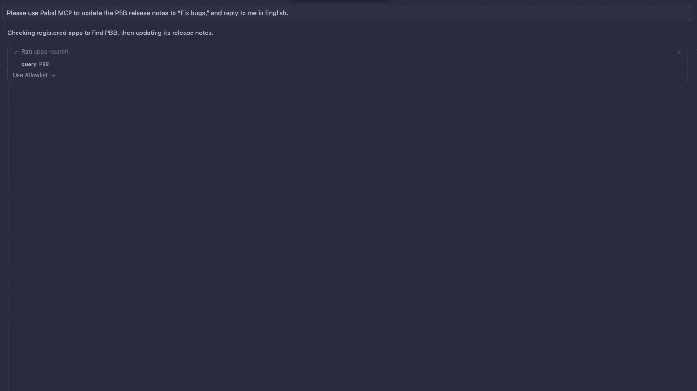

[](https://cursor.com/en/install-mcp?name=pabal-mcp&config=eyJjb21tYW5kIjoiYmFzaCIsImFyZ3MiOlsiL0FCU09MVVRFL1BBVEgvVE8vcGFiYWwtbWNwL3J1bi1tY3Auc2giXSwiY3dkIjoiL0FCU09MVVRFL1BBVEgvVE8vcGFiYWwtbWNwIn0%3D)

[](../README.md)

# pabal-mcp — App Store / Play Store ASO용 MCP 서버

앱스토어/플레이스토어 메타데이터, 릴리스, ASO 동기화를 MCP 도구로 제공합니다. Claude Code, Cursor, MCP Inspector 등 MCP 클라이언트에서 stdio 서버로 실행해 바로 사용할 수 있습니다.

> [!NOTE]
> 100% 로컬에서 실행되어 자격 증명과 캐시된 ASO 데이터가 외부로 전송되지 않습니다. 스토어 API 호출도 당신의 로컬 머신에서 직접 수행합니다.

## ❌ pabal-mcp 없이

- 스토어마다 클릭하며 업데이트
- 로캘·릴리스 노트 복붙 오류
- 프로젝트마다 반복 설정

## ✅ pabal-mcp와 함께

- 두 스토어 ASO 풀/푸시를 한 서버에서 처리
- 릴리스 노트 업데이트·버전 체크를 AI 클라이언트 안에서 수행
- 로컬 캐시/설정 기반의 재사용 가능한 워크플로

## 🛠️ 빠른 시작

1. Node.js 18+ 필요
2. 의존성 설치: `yarn install`
3. `secrets/`(gitignore) 아래 자격 증명 추가:
   1. App Store Connect API 키:
      - App Store Connect → Users and Access → [Keys](https://appstoreconnect.apple.com/access/integrations/api) → “Generate API Key”에서 Admin/App Manager 권한으로 키 생성 후 `.p8`를 다운로드합니다(한 번만 가능). 파일명을 `secrets/app-store-key.p8`로 저장하세요.
      - 키 상세 화면에서 Issuer ID와 Key ID를 복사해 `aso-config.json`에 넣을 준비를 합니다.
   2. Google Play 서비스 계정 JSON:
      - Play Console → API 액세스 → Google Cloud 프로젝트 연결/생성 → [서비스 계정 관리](https://console.cloud.google.com/projectselector2/iam-admin/serviceaccounts?supportedpurview=project) → 새 서비스 계정 생성(이름은 `pabal` 권장) → 키 생성 → JSON 다운로드.
      - 다운로드한 JSON을 `secrets/google-play-service-account.json`으로 저장합니다.
      - Play Console → [사용자 및 권한](https://play.google.com/console/u/0/developers/users-and-permissions) → 새 사용자 초대 → 서비스 계정 이메일 입력.
        - 앱 권한: ASO 작업할 앱들을 선택.
        - 계정 권한: 아래 항목을 체크(한국어):
          - 앱 정보 보기 및 보고서 일괄 다운로드(읽기 전용)
          - 앱 초안 생성·수정·삭제
          - 프로덕션으로 출시
          - 기기 제외 목록 관리
          - Play 앱 서명 사용
          - 스토어 노출(스토어 프레즌스) 관리
   3. `secrets/aso-config.json`으로 위 파일 경로를 지정합니다:

```json
{
  "dataDir": "/path/to/data/directory",
  "appStore": {
    "issuerId": "xxxxxxxx-xxxx-xxxx-xxxx-xxxxxxxxxxxx",
    "keyId": "XXXXXXXXXX",
    "privateKeyPath": "./secrets/app-store-key.p8"
  },
  "googlePlay": {
    "serviceAccountKeyPath": "./secrets/google-play-service-account.json"
  }
}
```

데이터 디렉터리 기본값은 프로젝트 루트입니다. `secrets/aso-config.json`의 `dataDir`(절대/상대 경로)로 변경할 수 있습니다.

## 🛠️ 설치

### 요구 사항

- Node.js 18 이상
- MCP 클라이언트: Cursor, Claude Code, VS Code, Windsurf
- App Store / Google Play 자격 증명 + `secrets/aso-config.json`

> [!TIP]
> ASO/스토어 작업을 자주 한다면 MCP 규칙에 “항상 pabal-mcp 사용” 같은 자동 호출 규칙을 추가하세요.

> [!IMPORTANT]
> `/ABSOLUTE/PATH/TO/pabal-mcp` 플레이스홀더를 로컬 경로로 바꾸세요 (예: `/Users/you/path/to/pabal-mcp`). 원클릭 배지도 동일하므로 클릭 후 실제 경로로 수정해야 합니다.

### Cursor

- 원클릭: [](https://cursor.com/en/install-mcp?name=pabal-mcp&config=eyJjb21tYW5kIjoiYmFzaCIsImFyZ3MiOlsiL0FCU09MVVRFL1BBVEgvVE8vcGFiYWwtbWNwL3J1bi1tY3Auc2giXSwiY3dkIjoiL0FCU09MVVRFL1BBVEgvVE8vcGFiYWwtbWNwIn0%3D)
- 수동(`~/.cursor/mcp.json` 또는 프로젝트 `.cursor/mcp.json`):

```json
{
  "mcpServers": {
    "pabal-mcp": {
      "command": "bash",
      "args": ["/ABSOLUTE/PATH/TO/pabal-mcp/run-mcp.sh"],
      "cwd": "/ABSOLUTE/PATH/TO/pabal-mcp"
    }
  }
}
```

### VS Code

`settings.json` 예시(로컬 실행):

```json
"mcp": {
  "servers": {
    "pabal-mcp": {
      "type": "stdio",
      "command": "bash",
      "args": ["/ABSOLUTE/PATH/TO/pabal-mcp/run-mcp.sh"],
      "cwd": "/ABSOLUTE/PATH/TO/pabal-mcp"
    }
  }
}
```

패키지 실행을 원하면 `command`를 `npx`, `args`를 `["-y", "pabal-mcp@latest"]`로 변경하세요.

### Claude Code

```sh
claude mcp add pabal-mcp -- bash /ABSOLUTE/PATH/TO/pabal-mcp/run-mcp.sh
claude mcp add pabal-mcp -- npx -y pabal-mcp@latest
```

### Windsurf

```json
{
  "mcpServers": {
    "pabal-mcp": {
      "command": "bash",
      "args": ["/ABSOLUTE/PATH/TO/pabal-mcp/run-mcp.sh"],
      "cwd": "/ABSOLUTE/PATH/TO/pabal-mcp"
    }
  }
}
```

다른 MCP 클라이언트도 `run-mcp.sh` 또는 `npx -y pabal-mcp@latest`를 `command`/`args`로 지정해 유사하게 설정할 수 있습니다.

## 🚀 서버 실행

- 로컬 개발: `npm run dev:mcp` (프로젝트 루트에서 stdio MCP 서버 실행)
- MCP 클라이언트에서 `run-mcp.sh`를 호출하도록 설정하면 경로가 올바르게 잡힙니다. 예시:

```json
{
  "mcpServers": {
    "pabal-mcp": {
      "command": "bash",
      "args": ["/ABSOLUTE/PATH/TO/pabal-mcp/run-mcp.sh"],
      "cwd": "/ABSOLUTE/PATH/TO/pabal-mcp"
    }
  }
}
```

데이터 저장 위치는 `secrets/aso-config.json`의 `dataDir`로 지정하세요.

## 🔧 MCP 도구

- 인증
  - `auth-check`: App Store Connect / Google Play 인증 상태 확인
- 앱 관리
  - `apps-init`: 스토어 API에서 앱을 가져와 자동 등록 (Google Play는 `packageName` 필요)
  - `apps-add`: bundleId/packageName으로 단일 앱 등록
  - `apps-search`: 등록된 앱 검색
- ASO 동기화
  - `aso-pull`: ASO 데이터를 로컬 캐시(.aso/)에 가져오기
  - `aso-push`: 로컬 캐시(.aso/)의 ASO 데이터를 스토어에 반영
- 릴리스 관리
  - `release-check-versions`: 앱별 최신 버전 조회
  - `release-create`: 새 버전 생성
  - `release-pull-notes`: 릴리스 노트를 로컬 캐시(.aso/)에 가져오기
  - `release-update-notes`: 릴리스 노트/What’s New 업데이트

## ✅ 테스트

- 전체 테스트 실행: `npm test`
